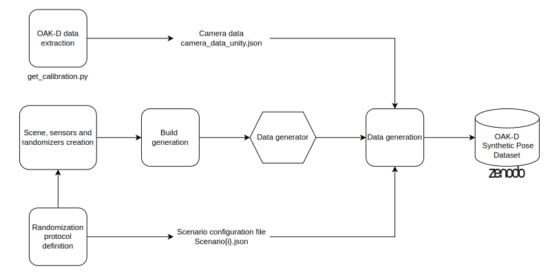
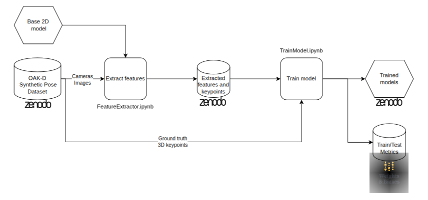
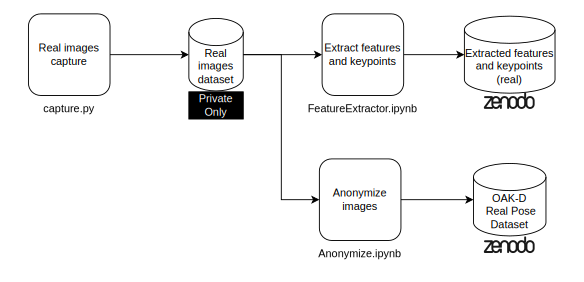

# `Estimação Estéreo de Pose Corporal 3D`
# `3D Stereo Body Pose Estimation`

## Apresentação

O presente projeto foi originado no contexto das atividades da disciplina de pós-graduação *IA904 - Projeto de Modelos em Computação Visual*, 
oferecida no primeiro semestre de 2024, na Unicamp, sob supervisão da Profa. Dra. Leticia Rittner e da Profa. Paula D. Paro Costa, ambas do Departamento de Engenharia de Computação e Automação (DCA) da Faculdade de Engenharia Elétrica e de Computação (FEEC).

Nome|RA|Curso
-|-|-
Elton Cardoso do Nascimento|233840|Mestrado em Engenharia Elétrica - Área de Concentração AE: Engenharia de Computação
Leonardo Rener de Oliveira|201270|Mestrado em Engenharia Elétrica - Área de Concentração AE: Engenharia de Computação

## Descrição do Projeto

Estimação de pose corporal é uma técnica amplamente utilizada em diversas indústrias como cinema e jogos, e se baseia na detecção de keypoints específicos no corpo de uma pessoa. Pode ser realizada desde utilizando equipamentos mais complexos e custosos como sistemas de mocap (motion capture), quanto por sensores mais simples como IMU (unidades de medição inercial), ou, utilizando IA (inteligência artificial), usando imagens de câmeras [1][2].

Mais especificamente, dentro do contexto universitário, é comum a necessidade de coletas simples de poses corporais, seja para testar e validar ideias em projetos de pesquisa, seja para realização de projetos de disciplina. Este tipo de demanda se beneficiaria de um método de coleta rápido e com pouca preparação, não necessitando de uma precisão tão grande quanto sistemas de mocap, como coleta a partir de imagens.

O objetivo deste projeto é então estimar a posição corporal no espaço 3D de uma pessoa, utilizando uma câmera estéreo (dipositivo com várias câmeras). Mais especificamente, este projeto utilizará uma "OAK-D", dipositivo desenvolvido para aplicações de visão computacional que possui três câmeras, duas laterais monocromáticas, global shutter e 720p; e uma central colorida, rolling shutter e 4K. A câmera se comunica com o computador através de um cabo USB-C, e também possui integrado processadores para execução de pipelines de processamento visual e IA [3].

## Metodologia

Nossa proposta é utilizar um modelo detector de keypoints 2D pronto e utilizá-lo como um extrator de features, removendo as últimas camadas, executando-o uma vez em cada entrada e concatenado as features obtidas, que serão usadas de entrada para uma rede treinável que deverá estimar as posições dos pontos no espaço 3D. O treino será realizado de forma supervisionada. Serão exploradas arquiteturas densas e CNNs.

A avaliação será quantitativa com os dados sintéticos, comparando a solução obtida com o ground truth e a triangularização. A avaliação será no espaço métrico 3D, visto que desejamos estimar de fato a posição absoluta de cada junta, e utilizando como métrica a soma do erro quadrático médio (MSE) de cada keypoint. Entre aspectos não determinados, keypoints não disponíveis em nenhuma das 3 imagens poderão ser mascarado; e como métrica alternativa pensamos em explorar o erro absoluto médio (MAE), para diminuir problemas com outliers. Para comparação, utilizaremos uma triangularização não-linear.

Arquitetura proposta:

Também será realizada uma avaliação qualitativa do modelo com dados reais da câmera, procurando irregularidades visuais entre a pose 3D obtida e o a pose visualizada na imagem.

## Bases de Dados e Evolução

Base de Dados | Endereço na Web | Resumo descritivo
-|-|-
OAK-D Synthetic Pose|Não publicado|Dataset de imagens sintéticas com avatares realizando diferentes poses. Sintetizado para simular a captura com uma OAK-D. Contém anotação de keypoints 2D e 3D.
OAK-D Real Pose|Não criado|Dataset de imagens reais realizando diferentes poses. Capturado utilizando uma OAK-D. Sem anotação.

Os dados serão sintetizados utilizando o motor de jogos Unity, que possui desenvolvido o pacote "Perception" para a geração de dados sintéticos [4]. Ela permitirá simular a configuração do dispositivo real e aplicando randomizações que julgarmos necessárias, tentando mitigar os efeitos da mudança do domínio virtual para real. Para a geração de "pessoas virtuais" utilizaremos o pacote "SyntheticHumans" [5].

São planejadas as randomizações: 
- Geração procedural de "pessoas virtuais"
- Pose da ‘pessoa virtual’
- Ruído aditivo na pose dos sensores
- Texturas de fundo
- Luz
- Parâmetros intrínsecos das câmeras
    - Foco
    - Tamanho do sensor   

Cada entrada no conjunto de dados será composto de três imagens, uma para cada câmera, com apenas uma pessoa em cena e keypoints no espaço 2D e 3D anotados para cada câmera. Outros metadados para análise poderão ser obtidos. Poderemos gerar quantos dados forem necessários, mas iremos começar gerando um dataset de por volta de 6400 entradas. As imagens serão salvas em formato PNG, enquanto que outros dados serão em arquivo JSON. 

O dataset é divivido nos seguintes conjuntos:

Nome do conjunto | Nome explicativo | Tipo | Descrição
-|-|-|-
Scenario0|Fixed|Treino|Parâmetros da câmera fixos
Scenario1|WeakNormal|Treino|Parâmetros da câmera com randomização aditiva fraca e normalmente variada
Scenario2|StrongNormal|Treino|Parâmetros da câmera com randomização aditiva forte e normalmente variada
Scenario3|StrongUniform|Teste|Parâmetros da câmera com randomização aditiva fraca e uniformemente variada
Scenario4|Fixed-Test|Teste|Parâmetros da câmera fixos

Uma descrição mais detalhada do protocolo de geração pode ser obtido em [OAK-D Synthetic Pose Dataset Generation Protocol](https://github.com/EltonCN/IA904-2024S1/blob/7b13886703576c74ecca8f1b1dd751d36a8c1896/projetos/3DStereoBodyPoseEstimation/data/OAK-D%20Synthetic%20Pose%20Dataset%20Generation%20Protocol.pdf).

Em adição a este conjunto, coletaremos também para avaliação um dataset de imagens reais não anotadas com a OAK-D, também com uma pessoa em cena em diferentes posições.

## Ferramentas

-  Unity para geração de dados sintéticos 
-  PyTorch para treino de modelos.

## Principais desafios

O maior problema a ser enfrentado será a transferência do modelo do domínio sintético para o real, o que poderá levar a necessidade iterativa de diversificação das imagens geradas. A avaliação do modelo no domínio real também será um desafio. Um terceiro problema será a arquitetura exata do modelo que iremos criar.

## Cronograma

O projeto está dividido em 7 etapas distribuídas nas 9 semanas da disciplina:

Etapa|1|2|3|4|5|6|7|8|9
-|-|-|-|-|-|-|-|-|-
1-Geração de dados|||
2-Modelo pré-treinado||||
3-Modelo|||||
4-Apresentação Preliminar||||||
5-Métricas e Baseline||||||
6-Refinamento||||||||
7-Documentação e Apresentação|||||||||

1. Geração de dados: geração de dados sintéticos utilizando a Unity.
2. Modelo pré-treinado: busca e preparo do modelo pré-treinado que será utilizado.
3. Modelo: exploração arquitetural e hiperparamétrica do modelo que será treinado.
4. Apresentação Preliminar: preparação da apresentação preliminar para a disciplina.
5. Métricas e Baseline: implementação de métricas e baseline para comparação.
6. Refinamento: refinamento do modelo e dados.
7. Documentação e apresentação: documentação do projeto e preparação da apresentação para a disciplina.

## Workflow
- Geração de dados sintéticos

- Treino do modelo

- Coleta de dados reais

- Avaliação

## Experimentos e Resultados preliminares
- Gerador de dados sintéticos
  - Criação do gerador na game engine Unity, para geração das imagens configuradas para a câmera OAK-D. Definidos parâmetros dos randomizadores fixos (objetos, pessoas, poses) e parâmetros variáveis (câmeras).
- Criação do Dataset
  - Uso do gerador para criar um conjunto de dados inicial, onde cada instancia é composta por 3 imagens PNG, uma para cada câmera do OAK-D e por uma arquivo no formato JSON contendo os parâmetros intrínsecos das câmeras e os parâmetros do avatar humano. Uma amostra dos dados está disponível na pasta "Dataset".

## Próximos passos
1. Treinamento do modelo. Tempo estimado: 1 semana.
2. Codificar baseline - Triangularização Não-linear. Tempo estimado: 3 dias
3. Avaliação qualitativa. Tempo estimado: 2 dias
4. Refinamento, levantamento de possíveis melhorias. Tempo estimado: 2 dias

## Referências
[1] Zheng, Ce, et al. "Deep learning-based human pose estimation: A survey." ACM Computing Surveys 56.1 (2023): 1-37.

[2] Kumar, Pranjal, Siddhartha Chauhan, and Lalit Kumar Awasthi. "Human pose estimation using deep learning: review, methodologies, progress and future research directions." International Journal of Multimedia Information Retrieval 11.4 (2022): 489-521.

[3] “OAK-D — DepthAI Hardware Documentation 1.0.0 documentation.” Acesso em: 12 de maio de 2024. [Online]. Disponível em: https://docs.luxonis.com/projects/hardware/en/latest/pages/BW1098OAK/

[4] S. Borkman et al., “Unity Perception: Generate Synthetic Data for Computer Vision”. arXiv, 19 de julho de 2021. doi: 10.48550/arXiv.2107.04259.

[5] “Unity-Technologies/com.unity.cv.synthetichumans: A package for creating Unity Perception compatible synthetic people.” Acesso em: 12 de maio de 2024. [Online]. Disponível em: https://github.com/Unity-Technologies/com.unity.cv.synthetichumans
