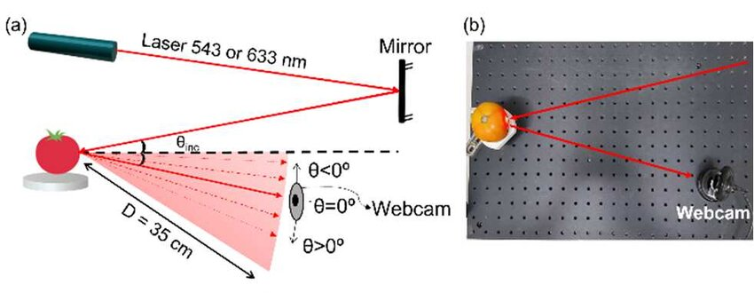
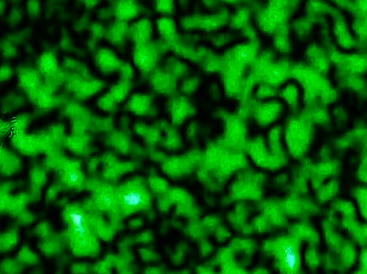
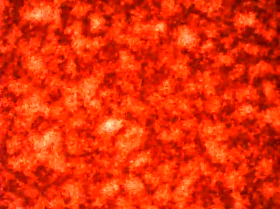

# `Análise de tomates em diferentes estágios de maturação utilizando biospeckle e deep learning`
# `Analysis of tomatoes at different ripening stages using biospeckle and deep learning`

## Apresentação

O presente projeto foi originado no contexto das atividades da disciplina de pós-graduação *IA904 - Projeto de Modelos em Computação Visual*, 
oferecida no primeiro semestre de 2024, na Unicamp, sob supervisão da Profa. Dra. Leticia Rittner e da Profa. Paula D. Paro Costa, ambas do Departamento de Engenharia de Computação e Automação (DCA) da Faculdade de Engenharia Elétrica e de Computação (FEEC).

|Nome  | RA | Curso|
|--|--|--|
|  Amauri Amilton Alves de Oliveira | 217136  | Doutorado em Tecnologia |
| Chen Jiahao  | 195673  | Graduação em Engenharia Elétrica |
| Juan  | 219148  | Mestrado em Engenharia Mecânica |

## Descrição do Projeto
O projeto consiste em analisar o biospeckle de um tomate para estimarmos o seu estágio de maturação utilizando uma rede neural convolucional. O biospeckle é uma ferramenta de analíse óptica não destrutiva de materiais biológicos, quando o objeto é iluminado por um feixe de luz "espalhado por uma superfície com rugosidades da ordem do comprimento de onda incidente ocorre a formação de uma estrutura granular no espaço livre à qual é dado o nome de speckle"(Silva, E. R. da ., & Muramatsu, M., 2007, p 283–286).

<figure>
    
    <figcaption>"(a) Assembly diagram for biospeckle capture of tomato using 633 nm and543 nm lasers. The beam is parallel to the table and with an incident angle of 19.5º. The angle of specular reflection was defined as θ = 0º. Negative angles are between the specular reflection and the incident beam (-19.5º, -13º, and -6.5º), while positive angles of theta are beyond the reflected specular reflection (6.5º and 13º). (b) Photo of the central part of the setup showing a representation of the laser beam, biological sample, and webcam."(J. F. Serighelli, E. Fujiwara and C. M. B. Cordeiro, 2023, pp. 1-2)</figcaption>
</figure>

## Metodologia

## Bases de Dados e Evolução

Base de Dados |  Resumo descritivo
----- | -----
Dataset pessoal de Juan | Acervo pessoal de iniciação científica realizada em 2023

<figure>
    
    <figcaption>Biospeckle com laser verde </figcaption>
</figure>

<figure>
    
    <figcaption>Biospeckle com laser vermelho </figcaption>
</figure>

## Ferramentas
As principais ferramentas para este projeto serão:
 * PyTorch
 * Google Colab

Como ferramentas auxiliares iremos 
## Principais desafios
O principal desafio do projeto está relacionado ao dataset, visto que ele é composto de diferentes estágios de maturação de um mesmo tomate o que dificultaria um treinamento supervisionado e da mesma forma a generalização do modelo. Uma solução em mente é inserirmos mais conjunto de dados de speckle como forma de interferência porém tomando sempre cuidado com o desbalanço de classes.
## Cronograma
Semana | Data | Objetivo
----- | ----- | -----
0 | 30/04 à 05/05 | Proposta de projeto e grupo
1 | 07/05 à 13/05 | Planejamento detalhado do projeto
2 | 14/05 à 20/05 | Criação do modelo base e testes iniciais
3 | 21/05 à 27/05 | Experimentação com outros modelos e data augmentation
4 | 28/05 à 03/06 | Preparação para entrega de resultados preliminares
5 | 04/06 à 10/06 | Escolha de melhor modelo e testes de desempenho
6 | 11/06 à 17/06 | Escolha de melhor modelo e testes de desempenho
7 | 18/06 à 25/05 | Preparação das conclusões finais e entrega de projeto

## Referências
J. F. Serighelli, E. Fujiwara and C. M. B. Cordeiro, "Quantitative Biospeckle Spectral and Angular Analysis of Tomatoes at Different Ripening Stages," 2023 International Conference on Optical MEMS and Nanophotonics (OMN) and SBFoton International Optics and Photonics Conference (SBFoton IOPC), Campinas, Brazil, 2023, pp. 1-2, doi: https://doi.org/10.1109/OMN/SBFotonIOPC58971.2023.10230977.

Silva, E. R. da ., & Muramatsu, M.. (2007). O fenômeno do speckle como introdução à metrologia óptica no laboratório didático. Revista Brasileira De Ensino De Física, 29(2), 283–286. https://doi.org/10.1590/S0102-47442007000200013

R. K. Gupta, G. D. Bruce, S. J. Powis, K. Dholakia, Deep Learning Enabled Laser Speckle Wavemeter with a High Dynamic Range. Laser & Photonics Reviews 2020, 14, 2000120. https://doi.org/10.1002/lpor.202000120