# `Análise de tomates em diferentes estágios de maturação utilizando biospeckle e deep learning`
# `Analysis of tomatoes at different ripening stages using biospeckle and deep learning`

## Apresentação

O presente projeto foi originado no contexto das atividades da disciplina de pós-graduação *IA904 - Projeto de Modelos em Computação Visual*, 
oferecida no primeiro semestre de 2024, na Unicamp, sob supervisão da Profa. Dra. Leticia Rittner e da Profa. Paula D. Paro Costa, ambas do Departamento de Engenharia de Computação e Automação (DCA) da Faculdade de Engenharia Elétrica e de Computação (FEEC).


|Nome  | RA | Curso|
|--|--|--|
| Chen Jiahao  | 195673  | Graduação em Engenharia Elétrica |
| Juan Felipe Serighelli | 219148  | Mestrado em Engenharia Mecânica |


## Descrição do Projeto
O projeto consiste em analisar o biospeckle de um tomate para estimarmos o seu estágio de maturação utilizando uma rede neural convolucional. O biospeckle é uma ferramenta de análise óptica não destrutiva de materiais biológicos, quando o objeto é iluminado por um feixe de luz "espalhado por uma superfície com rugosidades da ordem do comprimento de onda incidente ocorre a formação de uma estrutura granular no espaço livre à qual é dado o nome de speckle"(Silva, E. R. da ., & Muramatsu, M., 2007, p 283–286).

<figure>
    
    <figcaption>"(a) Assembly diagram for biospeckle capture of tomato using 633 nm and543 nm lasers. The beam is parallel to the table and with an incident angle of 19.5º. The angle of specular reflection was defined as θ = 0º. Negative angles are between the specular reflection and the incident beam (-19.5º, -13º, and -6.5º), while positive angles of theta are beyond the reflected specular reflection (6.5º and 13º). (b) Photo of the central part of the setup showing a representation of the laser beam, biological sample, and webcam."(J. F. Serighelli, E. Fujiwara and C. M. B. Cordeiro, 2023, pp. 1-2)</figcaption>
</figure>

## Metodologia
A principal metodologia a ser seguida será com base em [[3]](#3), no qual foi realizado o treinamento de uma rede neural para classificação de speckles de diferentes comprimentos de onda com o objetivo de verificar a eficácia do uso de deep learning para identificação de padrões em medição via speckle.

O artigo conclui que o uso de redes neurais são ideais para estas análises pois conseguem identificar e extrair detalhes relevantes presente nos dados uma vez que a tarefa mais difícil na medição por speckle não se trata de obter a medição mas sim analisá-la pois depende da interpretação e entendimento da variação dos padrões vistos no input. 

Na publicação [[1]](#1) o uso de Biospeckle se mostrou um novo método eficaz de avaliação de frutos pois não é destrutivo e é mais preciso sendo menos sujeito a uma mera análise por cor por ser capaz de quantificar a atividade biológica do fruto.

Dito isso, podemos então reaproveitar a metodologia utilizada nos artigos anteriores desta vez ao invés de classificar comprimentos de onda, iremos classificar o dia de maturação de um tomate do momento da sua colheita até trigésimo dia de maturação utilizando o biospeckle do tomate e seus respectivos dias de maturação e uma rede neural treinada por deep learning para identificar os padrões correspondentes ao dia de maturação.

Os modelos utilizados serão:
 * Modelo base de 3 camadas convolucionais para comparação.
 * Modelo proposto no artigo Deep Learning Enabled Laser Speckle Wavemeter with a High Dynamic Range.
 * Modelo classico de CNN, VGG16

Além disso, com base na publicação [[4]](#4) os modelos de CNNs mais tradicionais pecam em identificar texturas, portanto também será utilizado o modelo:
 * FENet

Assim como no artigo de R. K. Gupta, iremos avaliar os modelos com base na acurácia, F1-score e pela sua matriz de confusão.
## Bases de Dados e Evolução


Base de Dados | Datasheet |  Resumo descritivo
----- | ----- | -----
Dataset pessoal de Juan |  [Estrutura do dataset](./data/tomate_dataset.csv)<br /> [Estrutura do subset](./data/small_tomate_dataset.csv) | Acervo pessoal de iniciação científica realizada em 2023, acervo composto de vídeos que serão extraídos os frames em formato jpg de tamanho 480x640.
<div style="text-align:center">
    <figure>
        
        <figcaption>Biospeckle com laser verde </figcaption>
    </figure>
</div>

<div style="text-align:center">
    <figure>
        
        <figcaption>Biospeckle com laser vermelho </figcaption>
    </figure>
</div>

## Ferramentas
As principais ferramentas para este projeto serão:
 * PyTorch
 * Google Colab
 * scikit-learn
 * [alexlenail](http://alexlenail.me/NN-SVG/AlexNet.html)
 * draw.io

## Principais desafios

O principal desafio do projeto está relacionado ao tempo disponível para escolher os melhores parâmetros para se utilizar no treinamento, como por pré-processamento dos dados, utilizar rgb ou grayscale e/ou data augmentation. Além disso se mostrou importante manusear os dados de forma correta para que não ocorra modificações no dataset de forma indevida. 
## Cronograma
Semana | Data | Objetivo
----- | ----- | -----
0 | 30/04 à 05/05 | Proposta de projeto e grupo
1 | 07/05 à 13/05 | Planejamento detalhado do projeto
2 | 14/05 à 20/05 | Criação do modelo base e testes iniciais
3 | 21/05 à 27/05 | Experimentação com outros modelos e data augmentation
4 | 28/05 à 03/06 | Preparação para entrega de resultados preliminares
5 | 04/06 à 10/06 | Escolha de melhor modelo e testes de desempenho
6 | 11/06 à 17/06 | Escolha de melhor modelo e testes de desempenho
7 | 18/06 à 25/05 | Preparação das conclusões finais e entrega de projeto[4]

## Workflow

<div style="text-align:center">
    <figure>
        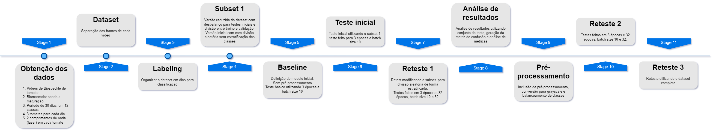
        <figcaption>Fluxograma </figcaption>
    </figure>
</div>

## Experimentos e Resultados preliminares

Antes de iniciar o experimento, foi definido um modelo inicial de 3 camadas convolucionais, com kernel de tamanho 7x7. Este será o modelo base em todos os experimentos.

```
----------------------------------------------------------------
        Layer (type)               Output Shape         Param #
================================================================
            Conv2d-1         [-1, 32, 239, 319]           4,704
         MaxPool2d-2         [-1, 32, 120, 160]               0
            Conv2d-3           [-1, 64, 59, 79]         100,352
         MaxPool2d-4           [-1, 64, 30, 40]               0
            Conv2d-5          [-1, 128, 14, 19]         401,408
         MaxPool2d-6           [-1, 128, 7, 10]               0
            Linear-7                  [-1, 120]       1,075,320
            Linear-8                   [-1, 84]          10,164
            Linear-9                   [-1, 12]             935
             Base-10                   [-1, 12]               0
================================================================
Total params: 1,592,883
Trainable params: 1,592,883
Non-trainable params: 0
```

<div style="text-align:center">
    <figure>
        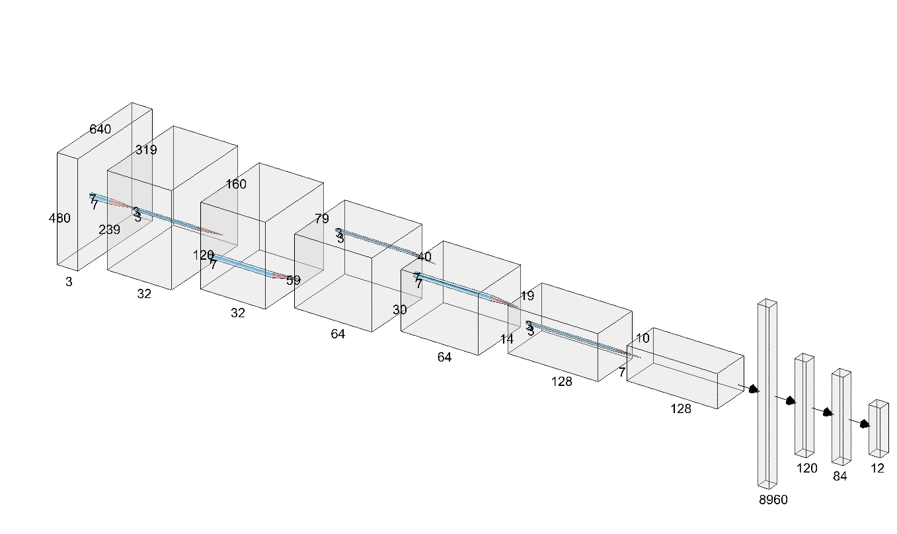
        <figcaption>3 Convolutional Layer CNN of Kernel 7x7, Max-Pool of 3x3.
        First feature extraction of depth 32, subsequent feature extraction of depth 64 and 128. 12 output features</figcaption>
    </figure>
</div>

### Teste inicial

O primeiro teste foi feito com o modelo descrito acima, com um **subset** do dataset original, de aproximadamente 13mil imagens com classes desbalanceadas.
 * Não foi feito pré-processamento
 * Divisão dos dados em treinamento, validação e teste. 60/20/20
 * Treinamento raso de 3 épocas e batch size 10
  
Resultados obtidos:

Resultado com baixa precisão, alta concentração de chutes para o dia 0. Além do dia 0 o modelo só conseguiu diferenciar os dias 11 e 31. Maior f1-score foi no dia 31. Era de se esperar pois os dados nesse dia possuem o maior intervalo de dias de maturação.

```
                precision    recall  f1-score   support
		
            0       1.00      0.23      0.38      1544
            1       0.00      0.00      0.00         0
            2       0.08      0.20      0.12       152
            3       0.00      0.00      0.00         0
            4       0.00      0.00      0.00         0
            5       0.00      0.00      0.00         0
            6       1.00      0.48      0.65       501
            7       0.00      0.00      0.00         0
            8       0.51      0.58      0.54       292
            9       0.00      0.00      0.00         0
            10       0.61      1.00      0.76       206

    accuracy                           0.37      2695
    macro avg       0.29      0.23      0.22      2695
weighted avg       0.87      0.37      0.46      2695
```
<div style="text-align:center">
    <figure>
        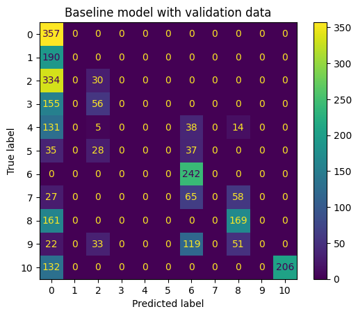
        <figcaption>Matriz de confusão do teste inicial. Labels de 0 a 10 onde representam respectivamente dias [0,1,2,3,4,5,7,9,11,24,31]</figcaption>
    </figure>
</div>

Erros cometidos:

 * Treino muito raso

 * Não houve verificação do dataset para o teste inicial, o subset do dataset completo ocorreu de forma inesperada pois faltou a inclusão do restante dos dados. Isso acarretou em desbalanceamento de classes de forma não intencional.
Este erro será carregado para os próximos testes.

 * A divisão dos dados foi feito de forma aleatória o que pode ter introduzido ainda mais desbalanceamento de classes. Além disso o subset foi dividido entre treinamento, validação e teste. 
Porém na análise de resultados, as funções utilizadas dividiam novamente o subset o que pode criar um conjunto de teste que contém dados utilizados no treinamento.

 * Erros de identificação dos dias na matriz de confusão.

### Teste com estratificação na divisão do dataset

Para resolver o problema do desbalanço de classes na divisão do dataset, foi utilizado a função do scikit-learn train_test_split com stratify habilitado com:
 * Não foi feito pré-processamento
 * Divisão dos dados em treinamento, validação e teste. 60/20/20
 * Treinamento raso de 3 épocas e batch size 10
  
Resultados obtidos:

Comparado ao experimento anterior, houve uma pequena melhoria com a perda da habilidade de reconhecer o dia 2 mas com mais precisão para reconhecer o dia 24 porém os problemas anteriormente mencionados se mantiveram nesse teste.

```
              precision    recall  f1-score   support

           0       1.00      0.24      0.38      1508
           1       0.00      0.00      0.00         0
           2       0.00      0.00      0.00         0
           3       0.00      0.00      0.00         0
           4       0.00      0.00      0.00         0
           5       0.00      0.00      0.00         0
           6       0.98      0.87      0.92       272
           7       0.00      0.00      0.00         0
           8       0.53      0.73      0.62       241
           9       0.48      0.30      0.37       361
          10       0.65      0.71      0.68       313

    accuracy                           0.41      2695
   macro avg       0.33      0.26      0.27      2695
weighted avg       0.85      0.41      0.49      2695
```

<div style="text-align:center">
    <figure>
        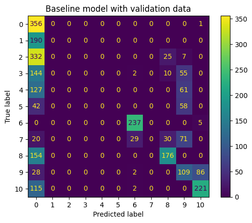
        <figcaption>Matriz de confusão do teste inicial. Labels de 0 a 10 onde representam respectivamente dias [0,1,2,3,4,5,7,9,11,24,31]</figcaption>
    </figure>
</div>

Erros cometidos:

 * Treino muito raso

 * Não houve verificação do dataset para o teste inicial, o subset do dataset completo ocorreu de forma inesperada pois faltou a inclusão do restante dos dados. Isso acarretou em desbalanceamento de classes de forma não intencional.
Este erro será carregado para os próximos testes.

 * Erros de identificação dos dias na matriz de confusão.

## Reteste com estratificação na divisão do dataset com treino mais longe

 * Não foi feito pré-processamento
 * Divisão dos dados em treinamento, validação e teste. 60/20/20
 * Treinamento de 32 épocas e batch size 32

Resultados obtidos:

Com um treino mais longo foi possível mitigar parcialmente os erros carregados do setup inicial, vemos que a precisão aumentou para 58% porém é possível notar que o modelo não está conseguindo diferenciar os dias que são próximos um do outro como visto nos dias 0, 1, 2, 3, 4 e 5 e é confirmado indice maior de acertos nos dias 7, 9, 11, 24 e 31.

```
              precision    recall  f1-score   support

           0       1.00      0.29      0.45      1233
           1       0.00      0.00      0.00         0
           2       0.63      0.93      0.75       247
           3       0.00      0.00      0.00         0
           4       0.00      0.00      0.00         0
           5       0.33      1.00      0.50        33
           6       1.00      0.90      0.95       270
           7       0.81      0.58      0.68       208
           8       0.54      0.85      0.66       210
           9       0.89      0.89      0.89       227
          10       0.63      0.79      0.70       267

    accuracy                           0.58      2695
   macro avg       0.53      0.57      0.51      2695
weighted avg       0.86      0.58      0.62      2695
```

<div style="text-align:center">
    <figure>
        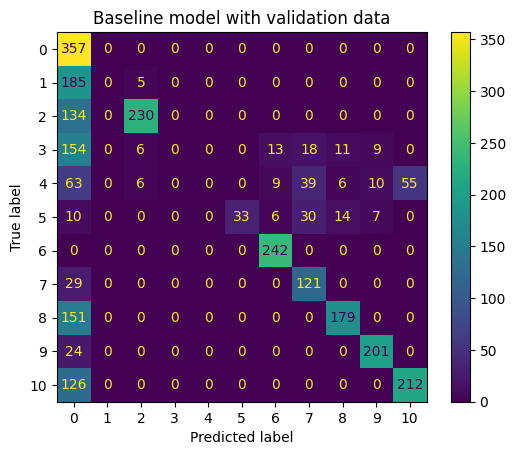
        <figcaption>Matriz de confusão do teste inicial. Labels de 0 a 10 onde representam respectivamente dias [0,1,2,3,4,5,7,9,11,24,31]</figcaption>
    </figure>
</div>


Erros cometidos:

 * Não houve verificação do dataset para o teste inicial, o subset do dataset completo ocorreu de forma inesperada pois faltou a inclusão do restante dos dados. Isso acarretou em desbalanceamento de classes de forma não intencional.
Este erro será carregado para os próximos testes.

 * Erros de identificação dos dias na matriz de confusão.

### Teste com conversão para grayscale

 * Pré-processamento convertendo imagem em grayscale
<div style="text-align:center">
    <figure>
        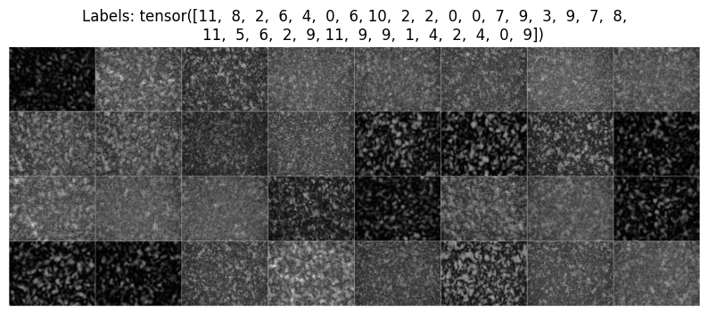
        <figcaption>Tensor com as imagens processadas em grayscale</figcaption>
    </figure>
</div>

 * Divisão dos dados em treinamento, validação e teste. 60/20/20
 * Treinamento de 32 épocas e batch size 32
  
Resultados obtidos:

A priore a acurácia diminuiu em relação a versão sem pré-processamento, porém se observamos a distribuição das predições podemos ver que antes a maioria se concentrava no dia 0, agora está disperso na matriz de confusão ou seja o modelo não está mais com o bias no dia 0

```
              precision    recall  f1-score   support

           0       1.00      0.44      0.61       820
           1       0.00      0.00      0.00         0
           2       0.00      0.00      0.00         0
           3       1.00      0.94      0.97       224
           4       0.00      0.00      0.00         0
           5       1.00      0.43      0.61       230
           6       1.00      0.71      0.83       339
           7       1.00      0.43      0.60       346
           8       0.00      0.00      0.00         0
           9       1.00      0.44      0.61       509
          10       0.58      0.86      0.69       227

    accuracy                           0.55      2695
   macro avg       0.60      0.39      0.45      2695
weighted avg       0.96      0.55      0.67      2695
```
<div style="text-align:center">
    <figure>
        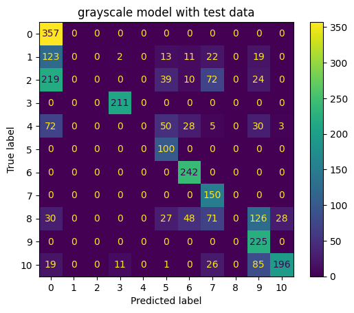
        <figcaption>Matriz de confusão do teste inicial. Labels de 0 a 10 onde representam respectivamente dias [0,1,2,3,4,5,7,9,11,24,31]</figcaption>
    </figure>
</div>

Erros cometidos:

 * Não houve verificação do dataset para o teste inicial, o subset do dataset completo ocorreu de forma inesperada pois faltou a inclusão do restante dos dados. Isso acarretou em desbalanceamento de classes de forma não intencional.
Este erro será carregado para os próximos testes.

 * Erros de identificação dos dias na matriz de confusão.
  
### Teste com conversão em grayscale e tratamento de desbalanço de classe

Como dito anteriormente, o subset está com desbalanço de classes, desta forma foi aplicado balanceamento de classes utilizando pesos na função de CrossEntropyLoss, onde os pessos foram calculados seguindo o recomendo pelo [scikit-learn compute_class_weight](https://scikit-learn.org/stable/modules/generated/sklearn.utils.class_weight.compute_class_weight.html):

\[\frac{n_{samples}}{(n_{classes}*count_{class})}\]

 * Pré-processamento convertendo em grayscale
 * Divisão dos dados em treinamento, validação e teste. 60/20/20
 * Treinamento de 32 épocas e batch size 32
 * Balanceamento de classes por pesos

Resultados obtidos:

Para o subset utilizando, a solução de aplicar pesos se mostrou eficaz pois houve um aumento de 20% de acurácia além de aparentar uma melhor distribuição de predições. Porém nota-se que há lacunas de predição nas labels 3 e 7, equivalente a dia 3 e dia 9 também nota-se que ainda há o bias de predição no dia 0.

```
              precision    recall  f1-score   support

           0       1.00      0.41      0.58       312
           1       1.00      0.96      0.98       104
           2       0.97      0.80      0.88       130
           3       0.00      0.00      0.00         0
           4       0.96      0.70      0.81       151
           5       0.90      0.86      0.88       105
           6       1.00      0.85      0.92       133
           7       0.00      0.00      0.00         0
           8       0.51      0.57      0.53        69
           9       0.84      1.00      0.91        96
          10       0.58      1.00      0.73        80

    accuracy                           0.72      1180
   macro avg       0.71      0.65      0.66      1180
weighted avg       0.91      0.72      0.78      1180
```

<div style="text-align:center">
    <figure>
        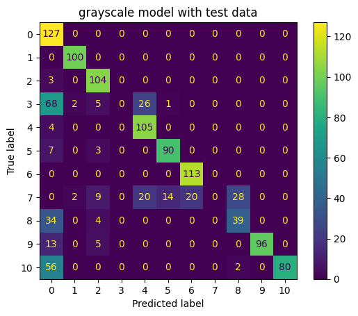
        <figcaption>Matriz de confusão do teste inicial. Labels de 0 a 10 onde representam respectivamente dias [0,1,2,3,4,5,7,9,11,24,31]</figcaption>
    </figure>
</div>

#### Avaliação do modelo utilizando conjunto de teste

Além do teste anterior foi feito um teste com um conjunto a parte isolado com as classes dia 0, dia 5 e dia 11 equivalente às labels 0, 5 e 8. O resultado não se mostrou satisfatório. Pode ser que ocorreu overfitting do modelo ou o conjunto de teste está catalogado de forma indevida

```
              precision    recall  f1-score   support

           0       0.00      0.00      0.00        23
           1       0.13      0.67      0.21         9
           2       0.26      0.23      0.25        43
           4       0.00      0.00      0.00        49

    accuracy                           0.13       124
   macro avg       0.10      0.22      0.12       124
weighted avg       0.10      0.13      0.10       124
```
<div style="text-align:center">
    <figure>
        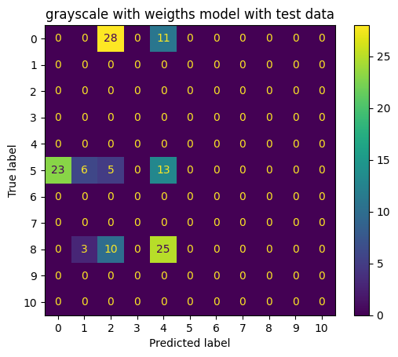
        <figcaption>Matriz de confusão do teste inicial. Labels de 0 a 10 onde representam respectivamente dias [0,1,2,3,4,5,7,9,11,24,31]</figcaption>
    </figure>
</div>

Erros cometidos:

 * Erros de identificação dos dias na matriz de confusão.
 * Possivelmente ocorreu overfitting do modelo

### Teste com dataset completo

Neste teste foi feito com o dataset inteiro, com todas as 63mil imagens, desta forma haverá a inclusão de uma classe a mais, o dia 15 e também será utilizado as seguintes configurações:

 * Modelo base de 3 camadas convolucionais
 * Pré-processamento convertendo em grayscale
 * Divisão dos dados em treinamento e validação. 80/20
 * Treinamento de 32 épocas e batch size 32
 * Não foi feito balanceamento de classes pois as classes possui quantidades semelhantes de amostra

Resultados obtidos:

Apesar de atingir uma acurácia de 91% com o conjunto de validação, ao realizar um teste com o conjunto de testes mencionado anteriormente, a precisão cai para 10% logo podemos confirmar que o modelo está tendo overfitting. Além de que o modelo teve apenas 11 épocas de treinamento, não finalizando as 32 épocas.


```
              precision    recall  f1-score   support

           0       0.49      0.94      0.65       562
           1       0.94      0.64      0.76      1471
           2       0.55      0.99      0.70       579
           3       1.00      0.98      0.99      1072
           4       1.00      0.89      0.94      1211
           5       0.99      0.95      0.97      1098
           6       0.99      1.00      0.99      1046
           7       1.00      0.91      0.95      1147
           8       1.00      0.92      0.96      1151
           9       1.00      0.93      0.97      1124
          10       0.99      0.94      0.97      1112
          11       0.99      1.00      0.99      1104

    accuracy                           0.91     12677
   macro avg       0.91      0.92      0.90     12677
weighted avg       0.95      0.91      0.92     12677
```

<div style="text-align:center">
    <figure>
        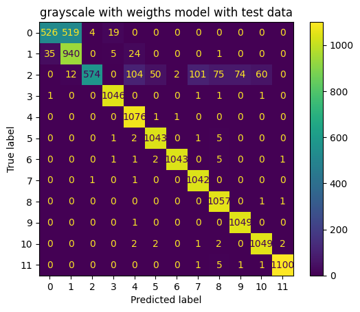
        <figcaption>Matriz de confusão do teste inicial. Labels de 0 a 11 onde representam respectivamente dias [0,1,2,3,4,5,7,9,11,15,24,31]</figcaption>
    </figure>
</div>

#### Avaliação do modelo utilizando conjunto de teste
```
              precision    recall  f1-score   support

           0       0.10      0.80      0.18         5
           1       0.19      0.29      0.23        31
           2       0.00      0.00      0.00        38
           3       0.00      0.00      0.00         8
           4       0.00      0.00      0.00        33
           5       0.00      0.00      0.00         4
          10       0.00      0.00      0.00         5

    accuracy                           0.10       124
   macro avg       0.04      0.16      0.06       124
weighted avg       0.05      0.10      0.07       124
```
<div style="text-align:center">
    <figure>
        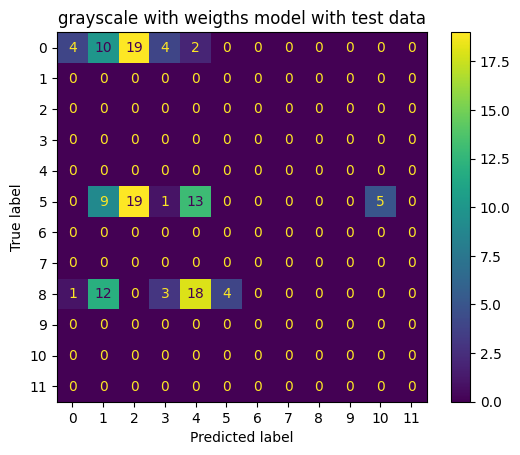
        <figcaption>Matriz de confusão do teste inicial. Labels de 0 a 11 onde representam respectivamente dias [0,1,2,3,4,5,7,9,11,15,24,31]</figcaption>
    </figure>
</div>

Erros cometidos:

 * Overfitting do modelo

## Próximos passos

Para os próximos passos iremos explorar a utilização de normalização dos valores de entrada e aplicar o BatchNorm2D no modelo e incluir uma camada de Dropout para lidar com o overfitting. Além disso testaremos diminuir o learning rate visto que em apenas 11 épocas o modelo já atingiu 91% de acurácia no modelo de validação. 

Conforme a finalização do projeto se aproxima, possivelmente não acontecerá os testes em modelos pré-treinados.

## Referências
<a id="1">[1]</a> J. F. Serighelli, E. Fujiwara and C. M. B. Cordeiro, "Quantitative Biospeckle Spectral and Angular Analysis of Tomatoes at Different Ripening Stages," 2023 International Conference on Optical MEMS and Nanophotonics (OMN) and SBFoton International Optics and Photonics Conference (SBFoton IOPC), Campinas, Brazil, 2023, pp. 1-2, doi: https://doi.org/10.1109/OMN/SBFotonIOPC58971.2023.10230977.

<a id="2">[2]</a> Silva, E. R. da ., & Muramatsu, M.. (2007). O fenômeno do speckle como introdução à metrologia óptica no laboratório didático. Revista Brasileira De Ensino De Física, 29(2), 283–286. https://doi.org/10.1590/S0102-47442007000200013

<a id="3">[3]</a>  R. K. Gupta, G. D. Bruce, S. J. Powis, K. Dholakia, Deep Learning Enabled Laser Speckle Wavemeter with a High Dynamic Range. Laser & Photonics Reviews 2020, 14, 2000120. https://doi.org/10.1002/lpor.202000120

<a id="4">[4]</a>  https://medium.com/@trapti.kalra/why-traditional-cnns-may-fail-for-texture-based-classification-3b49d6b94b6f