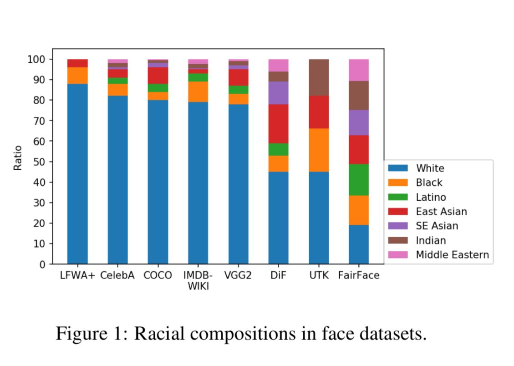

# `Desvendando Viés: Uma Análise dos Algoritmos de Imagem e Reconhecimento Facial`
# `Unraveling Bias: An Analysis of Image and Facial Recognition Algorithms`

## Apresentação

O presente projeto foi originado no contexto das atividades da disciplina de pós-graduação *IA904 - Projeto de Modelos em Computação Visual*, 
oferecida no primeiro semestre de 2024, na Unicamp, sob supervisão da Profa. Dra. Leticia Rittner e da Profa. Paula D. Paro Costa, ambas do Departamento de Engenharia de Computação e Automação (DCA) da Faculdade de Engenharia Elétrica e de Computação (FEEC).

Segue tabela com as informações dos alunos do projeto:

|Nome  | RA | Curso|
|--|--|--|
| Leonardo Vilela de Abreu Silva Pereira | 220198 | Aluno Especial |
| Sílvia Claudino Martins Gomes | 271629 | Aluna Especial |

## Descrição do Projeto
O projeto visa compreender o viés racial em modelos amplamente reconhecidos na literatura. Para este estudo, será utilizada uma base de dados de imagens de rostos de pessoas de diversas etnias, denominada FairFace. Serão aplicados modelos de visão computacional populares na comunidade de processamento de imagens para serem comparados. Espera-se, ao final do projeto, compreender quais modelos apresentam melhor desempenho em relação ao viés racial.

## Metodologia
Nesta seção, será descrita a metodologia aplicada para a realização do projeto. Quanto ao pré-processamento, espera-se realizar pouco ou nenhum, uma vez que visamos analisar o comportamento dos modelos e entender quais hiperparâmetros devem ser ajustados para reduzir o viés racial em cada um deles. Além disso, pretendemos ampliar o conjunto de dados. Para isso, serão utilizadas diversas técnicas de aumento de dados, respeitando o balanceamento das etnias existentes no conjunto. Para a aplicação dos modelos, pretende-se trabalhar com aprendizado supervisionado, visto que a base de dados possui rótulos de pessoa e etnia. Serão aplicados cinco modelos de visão computacional populares na comunidade de processamento de imagens:

- ImageNet
- ResNet
- Inception
- VGG16 
- CNN (customizada pelos integrantes)

Assim, poderemos estudar os melhores modelos e ajustes de hiperparâmetros que evitam o viés racial no modelo. Por último, será possível aplicar técnicas de explicabilidade, como atribuição de saliência e mapas de ativação, para entender quais características da imagem os modelos estão dando maior foco.

## Bases de Dados e Evolução
A base de dados que será utilizada será a [FairFace](https://github.com/joojs/fairface). Um conjunto de dados de atributos faciais para raças, gêneros e idades equilibrados. [1] Conhecida por realizar um bom balanceamento entre as diversas etnias presentes no conjunto como é possível visualizar na imagem a seguir

A base de dados possui dois conjunto separados, um composto para o treino, com 86744 imagens, e o outro composto para a validação, com 10954 imagens. Além do gráfico, podemos analisar os dados de balanceamento através da tabela a seguir, com a quantidade de imagens para cada etnia no conjunto de treino e validação.

|Etnia  | Treino | Validação |
|--|--|--|
| White | 16527 | 2085 |
| Latino Hispanic | 13367 | 1623 |
| Indian | 12319 | 1556 |
| East Asian | 12287 | 1550 |
| Black | 12233 | 1516 |
| Southeast Asian | 10795 | 1415 |
| Middle Eastern | 9216 | 1209 |

A seguir, será apresentado um resumo em forma de tabela com as principais informações da base de dados.

Base de Dados | Endereço na Web | Resumo descritivo
----- | ----- | -----
FairFace | https://github.com/dchen236/FairFace | Um conjunto de dados de atributos faciais para raças, gêneros e idades equilibrados. [1]

## Ferramentas

Serão apresentadas a seguir as ferramentas e bibliotecas a serem utilizadas durante o projeto.

Biblioteca principal:
- PyTorch

Data-augmentation:
- Random Rotation
- Random Horizontal Flip
- Random Vertical Flip
- Random Resized Crop

Modelos:
- ImageNet
- ResNet
- Inception
- VGG16 (Visual Geometry Group)
- CNN (Convolutional Neural Network)

Avaliação de modelos:
- Weights & Biases

Cálculo de métricas:
- TorchEval

Explicabilidade:
- Grad-cam
- Saliency Vanilla_gradient

## Principais desafios
Durante o projeto, prevemos encontrar desafios significativos ao lidar com questões éticas. Como sabemos, há uma variedade de vertentes e discussões valiosas que exigirão estudo cuidadoso. O reconhecimento facial, estudado neste projeto, é muitas vezes considerado uma prática invasiva que pode colocar em risco indivíduos pertencentes a minorias em determinados países. Eles podem ser erroneamente identificados ou analisados como ameaças à segurança por modelos de reconhecimento facial. No entanto, compreender a injustiça e o preconceito presentes nessas situações é uma tarefa complexa. Um desafio adicional será entender o conceito de etnia, especialmente em uma cultura tão diversa e miscigenada como a nossa.

## Cronograma
Nesta seção será apresentado o cronograma do projeto.

|Semana | Data | Atividade |
|--|--|--|
| Semana 1 | 28/04 à 04/05 | Definição do projeto |
| Semana 2 | 05/05 à 11/05 | Documentação e planejamento do projeto |
| Semana 3 | 12/05 à 18/05 | Aplicação do modelo ImageNet e ResNet |
| Semana 4 | 19/05 à 25/05 | Aplicação do modelo Inception e VGG |
| Semana 5 | 26/05 à 01/06 | Aplicação do modelo CNN |
| Semana 6 | 02/06 à 08/06 | Comparação entre modelos e visualização de explicabilidade |
| Semana 7 | 09/06 à 15/06 | Documentação e escrita das conclusões do projeto |
| Semana 8 | 16/06 à 22/06 | Revisão e preparação da apresentação |

## Referências

[1] FairFace. 2021. "FairFace: Face Attribute Dataset for Balanced Race, Gender, and Age". https://github.com/joojs/fairface

[2] Kärkkäinen, K., & Joo, J. (2019). FairFace: Face Attribute Dataset for Balanced Race, Gender, and Age. Recuperado de https://doi.org/10.48550/arXiv.1908.04913

[3] Cavazos, J. G., Phillips, P. J., Castillo, C. D., & O’Toole, A. J. (2021). Accuracy Comparison Across Face Recognition Algorithms: Where Are We on Measuring Race Bias? IEEE Transactions on Biometrics, Behavior, and Identity Science, 3(1), 101–111. DOI: 10.1109/TBIOM.2020.3027269
 